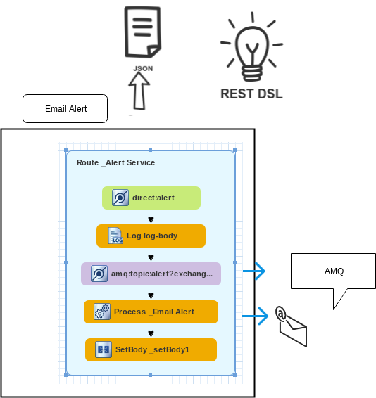

# Back-end Service 2
## User alert service

This demo demonstrates how to integrate a Spring-Boot application to an ActiveMQ broker and use JMS messaging between two Camel routes using OpenShift.


### Background


This service sends an email alert and exposes an API endpoints, by receiving input as JSON. This content is later sent to a messaging broker, and then picked up by a bean, which simply processes email parameters and returns a result of the email status.

 


  

### Building

The example can be built with

    mvn clean install

### Running the example locally

The example can be run locally using the following Maven goal:

    mvn spring-boot:run


url: 

http://localhost:8080/cicd/alert

post params :

```json

{
  "alertType": "WEATHER",
  "firstName": "test",
  "date": "11/8/2019",
  "phone": "1234567",
  "email": "< with your email addresses >,
  "description": "test alert service"
}

```


Email Conifg:

 - Update src/main/resources/application.yml with email server configuration.
 - Insert your email credentials, we are using GMAIL as example.


### Running the example in OpenShift

It is assumed that:
- OpenShift platform is already running, if not you can find details how to [Install OpenShift at your site](https://docs.openshift.com/container-platform/3.3/install_config/index.html).
- Your system is configured for Fabric8 Maven Workflow, if not you can find a [Get Started Guide](https://access.redhat.com/documentation/en/red-hat-jboss-middleware-for-openshift/3/single/red-hat-jboss-fuse-integration-services-20-for-openshift/)

The example can be built and run on OpenShift using a single goal:

    mvn fabric8:deploy

When the example runs in OpenShift, you can use the OpenShift client tool to inspect the status

To list all the running pods:

    oc get pods

Then find the name of the pod that runs this quickstart, and output the logs from the running pods with:

    oc logs <name of pod>

You can also use the OpenShift [web console](https://docs.openshift.com/container-platform/3.3/getting_started/developers_console.html#developers-console-video) to manage the
running pods, and view logs and much more.

### Running via an S2I Application Template

Application templates allow you deploy applications to OpenShift by filling out a form in the OpenShift console that allows you to adjust deployment parameters.  This template uses an S2I source build so that it handle building and deploying the application for you.

First, import the Fuse image streams:

    oc create -f https://raw.githubusercontent.com/jboss-fuse/application-templates/GA/fis-image-streams.json

Then create the quickstart template:

    oc create -f https://raw.githubusercontent.com/jboss-fuse/application-templates/GA/quickstarts/spring-boot-camel-template.json

Now when you use "Add to Project" button in the OpenShift console, you should see a template for this quickstart. 

