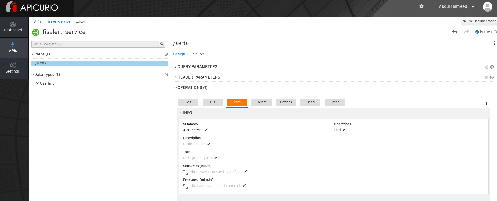
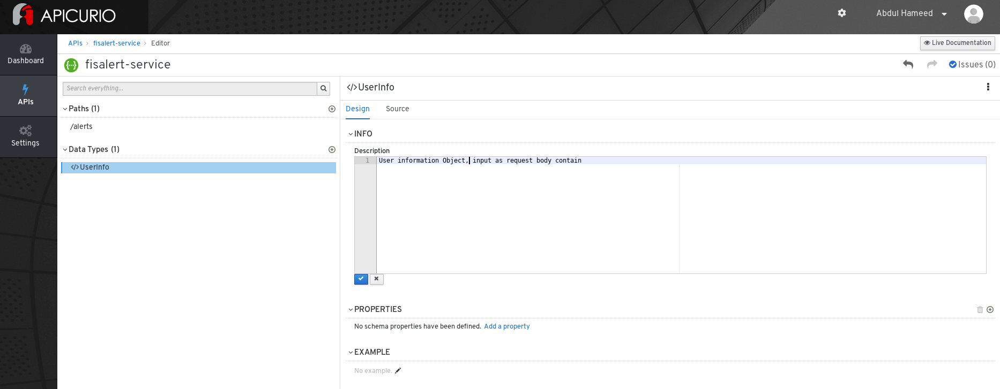
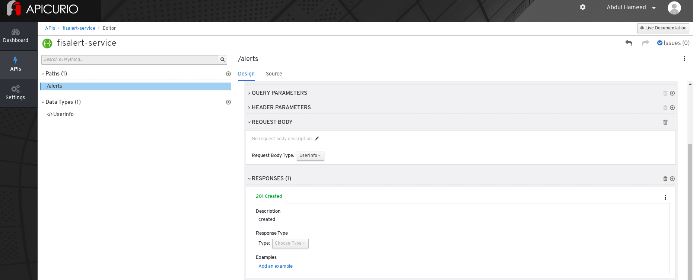

#  User alert - Service 

This Project demonstrates how to use Apicurio to design API and integrate a Spring-Boot application to an ActiveMQ broker and use JMS messaging between two Camel routes using OpenShift.

### API Curio setup 

- you can add Apicurito as a service to your OpenShift project by following the [link](/setup/adding_apicurito_as_a_service_ocp.md)
  
### Design and develop an API definition with Apicurito

Open apicurito route and Click New API.
                             
change the API name: Hover the cursor over the name and then click the edit icon (  apicurito pencil ) that appears.
Edit the name as ```fuse-alert-service```, Click Save.                             


 ")

Start adding the paths to the document.

 


Add parameters and define their type.

 
  

Add Request body and Define response 201

 


Save API 
  
Click Save As → Save as JSON.

The JSON file is downloaded to your local download folder. The default filename is openapi-spec, rename it as a ``fuse-alert-service.json``

For more detail follow the [blog](https://access.redhat.com/documentation/en-us/red_hat_fuse/7.2/html-single/designing_apis_with_apicurito/index#p_creating_api_create-api-definition)

###  Generate / Integrate a Fuse Camel project from Apicurito

You can use Apicurito to generate a Fuse Camel project based on an API definition. By following below steps

1. Select the OpenAPI definition ```fuse-alert-service.json``` file and then click Open.  
2. The OpenAPI definition opens in the Apicurito console. Click Generate.
2. Select Fuse Camel Project from the drop-down list.
3. Apicurito generates a camel-project.zip file and downloads it to your local default download folder and Unzip it .
4. used Red Hat Developer Studio or other tool and Import  Maven Projects.
5. Open the project’s camel-context.xml file in the editor view. Click the REST tab to edit the Rest DSL components.

 

### Building

The example can be built with

    mvn clean install

### Testing the API locally

run locally using the following Maven goal:


    mvn spring-boot:run


url: 

http://localhost:8080/cicd/alerts

post params :

```json

{
  "alertType": "WEATHER",
  "firstName": "test",
  "date": "11/8/2019",
  "phone": "1234567",
  "email": "< with your email addresses >,
  "description": "test alert service"
}

```
view the API Doc       
   
   - <http://localhost:8080/cicd/fuse-alert-service.json>    
    
### Implemention


This service sends an email alert and exposes an API endpoints, by receiving input as JSON. This content is later sent to a messaging broker, and then picked up by a bean, which simply processes email parameters and returns a result of the email status.


  

Email Conifg:

 - Update src/main/resources/application.yml with email server configuration.
 - Insert your email credentials, we are using GMAIL as example.

### Running the example in OpenShift

It is assumed that:
- OpenShift platform is already running, if not you can find details how to [Install OpenShift at your site](https://docs.openshift.com/container-platform/3.3/install_config/index.html).
- Your system is configured for Fabric8 Maven Workflow, if not you can find a [Get Started Guide](https://access.redhat.com/documentation/en/red-hat-jboss-middleware-for-openshift/3/single/red-hat-jboss-fuse-integration-services-20-for-openshift/)

The example can be built and run on OpenShift using a single goal:

    mvn fabric8:deploy

When the example runs in OpenShift, you can use the OpenShift client tool to inspect the status

To list all the running pods:

    oc get pods

Then find the name of the pod that runs this quickstart, and output the logs from the running pods with:

    oc logs <name of pod>

You can also use the OpenShift [web console](https://docs.openshift.com/container-platform/3.3/getting_started/developers_console.html#developers-console-video) to manage the
running pods, and view logs and much more.

### Running via an S2I Application Template

Application templates allow you deploy applications to OpenShift by filling out a form in the OpenShift console that allows you to adjust deployment parameters.  This template uses an S2I source build so that it handle building and deploying the application for you.

First, import the Fuse image streams:

    oc create -f https://raw.githubusercontent.com/jboss-fuse/application-templates/GA/fis-image-streams.json

Then create the quickstart template:

    oc create -f https://raw.githubusercontent.com/jboss-fuse/application-templates/GA/quickstarts/spring-boot-camel-template.json

Now when you use "Add to Project" button in the OpenShift console, you should see a template for this quickstart. 

